<div style="display:flex;flex-wrap:wrap;gap:10px;justify-content:center;margin:4px 0 12px 0;">
  <a href="https://github.com/vxcontrol/pentagi" target="_blank" rel="noopener" style="display:inline-flex;align-items:center;gap:10px;padding:8px 14px;border:1px solid #d0d7de;border-radius:12px;background:#f6f8fa;color:#24292f;text-decoration:none;font-weight:700;">
    <span style="font-size:14px;">📅</span>
    <span>Create Date</span>
    <span style="display:inline-flex;align-items:center;justify-content:center;min-width:92px;height:24px;padding:0 8px;border-radius:999px;background:#eaeef2;color:#24292f;font-weight:700;font-size:12px;">2025-01-06</span>
  </a>
  <a href="https://github.com/vxcontrol/pentagi/stargazers" target="_blank" rel="noopener" style="display:inline-flex;align-items:center;gap:10px;padding:8px 14px;border:1px solid #d0d7de;border-radius:12px;background:#f6f8fa;color:#24292f;text-decoration:none;font-weight:700;">
    <span style="font-size:14px;">⭐</span>
    <span>Star</span>
    <span style="display:inline-flex;align-items:center;justify-content:center;min-width:58px;height:24px;padding:0 8px;border-radius:999px;background:#eaeef2;color:#24292f;font-weight:700;font-size:12px;">7,895</span>
  </a>
  <a href="https://github.com/vxcontrol/pentagi/fork" target="_blank" rel="noopener" style="display:inline-flex;align-items:center;gap:10px;padding:8px 14px;border:1px solid #d0d7de;border-radius:12px;background:#f6f8fa;color:#24292f;text-decoration:none;font-weight:700;">
    
    <span>Fork</span>
    <span style="display:inline-flex;align-items:center;justify-content:center;min-width:52px;height:24px;padding:0 8px;border-radius:999px;background:#eaeef2;color:#24292f;font-weight:700;font-size:12px;">891</span>
  </a>
</div>

<div style="display:flex;flex-wrap:wrap;gap:8px;justify-content:center;margin:8px 0 14px 0;">
  <span style="display:inline-flex;align-items:center;gap:8px;padding:6px 12px;border-radius:4px;background:#00ADD8;color:#ffffff;font-weight:700;"><span style="font-size:12px;color:#ffffff;">Go</span></span>
  <span style="display:inline-flex;align-items:center;gap:8px;padding:6px 12px;border-radius:4px;background:#61DAFB;color:#0b2438;font-weight:700;"><span style="font-size:12px;color:#0b2438;">React</span></span>
  <span style="display:inline-flex;align-items:center;gap:8px;padding:6px 12px;border-radius:4px;background:#3178C6;color:#ffffff;font-weight:700;"><span style="font-size:12px;color:#ffffff;">TypeScript</span></span>
  <span style="display:inline-flex;align-items:center;gap:8px;padding:6px 12px;border-radius:4px;background:#2496ED;color:#ffffff;font-weight:700;"><span style="font-size:12px;color:#ffffff;">Docker</span></span>
  <span style="display:inline-flex;align-items:center;gap:8px;padding:6px 12px;border-radius:4px;background:#4169E1;color:#ffffff;font-weight:700;"><span style="font-size:12px;color:#ffffff;">PostgreSQL</span></span>
</div>

PentAGI는 단순히 "보안 챗봇"이 아니라, 침투 테스트 과정을 **Flow(작업 흐름) 단위로 설계·실행·기록**하는 운영형 플랫폼입니다.
코드 기준으로는 `backend/cmd/pentagi/main.go`에서 설정/DB/Provider/Router를 조립하고, `backend/pkg/controller/flow.go`의 워커가 실제 테스트를 단계적으로 실행합니다.
즉 "질문에 답하는 AI"보다 "도구를 호출해 작업을 끝내는 에이전트"에 가깝고, REST/GraphQL/UI가 함께 제공돼 팀 운영과 자동화를 동시에 잡기 좋습니다(`backend/pkg/server/router.go`).
또한 OpenAI/Anthropic/Gemini/Bedrock/Ollama/Custom provider를 선택적으로 붙일 수 있어 벤더 종속(한 업체에만 묶이는 문제)을 낮추는 구조입니다(`backend/pkg/providers/providers.go`, `.env.example`).
그래서 실무에서 어떤 가치가 생기는지 관점에서 보면, PentAGI의 본질은 "AI 기능 추가"가 아니라 **재현 가능한 보안 운영 체계**를 만드는 데 있습니다.

https://youtu.be/R70x5Ddzs1o
*출처: README - PentAGI Overview Video*

## 1. 🔍 핵심 기능 및 구현 방식 (Core Features & Implementation)


*출처: README - Architecture(System Context/Container Architecture) 기반 요약도*

- **기능 1) Flow/Task/Subtask 기반 실행 오케스트레이션**
  - PentAGI는 테스트 요청을 한 번에 처리하지 않고, `Flow → Task → Subtask`로 쪼개 실행합니다(`backend/docs/flow_execution.md`, `backend/pkg/controller/flow.go`).
  - `NewFlowController`와 `NewFlowWorker`가 실행 단위를 생성하고, 내부 `worker()`/`runTask()` 루프로 작업을 순차 처리합니다(`backend/pkg/controller/flows.go`, `backend/pkg/controller/flow.go`).
  - 이 구조 덕분에 "어느 단계에서 막혔는지"를 추적하기 쉽고, 중단 후 재개 시에도 상태를 이어가기 좋습니다(작업 끊김 복구).
  - 그래서 실무에서 어떤 가치가 생기는지 보면, 담당자 교체나 야간 장애 상황에서도 컨텍스트 유실을 줄여 운영 안정성이 올라갑니다.

- **기능 2) 툴콜 중심 에이전트 실행(말이 아니라 행동 중심)**
  - 핵심 체인은 `performAgentChain`에서 돌고, 실제 액션은 `execToolCall`로 실행됩니다(`backend/pkg/providers/performer.go`).
  - 반복 호출 감지(`repeatingDetector`), 인자 보정, 재시도 흐름이 구현되어 있어 "LLM이 불안정하게 응답할 때"를 방어합니다(`backend/pkg/providers/helpers.go`, `backend/pkg/providers/performer.go`).
  - 도구 레이어도 환경/검색/메모리/전문가 에이전트 카테고리로 분리돼 있어 확장성이 높습니다(`backend/pkg/tools/registry.go`).
  - 그래서 실무에서 어떤 가치가 생기는지 관점에서는, 단순 텍스트 답변보다 **재현 가능한 실행 로그**를 만들기 쉬워 감사/리포팅 품질이 올라갑니다.

- **기능 3) Docker 격리 실행 + 분산 워커 노드 아키텍처**
  - 기본 실행은 컨테이너 격리 전제를 둡니다. `docker-compose.yml`에서도 `docker.sock`을 마운트해 워커 작업을 관리합니다.
  - 보안 민감 환경을 위해 메인 노드/워커 노드 분리 가이드가 별도로 제공되며, TLS 기반 Docker API 연결까지 문서화돼 있습니다(`examples/guides/worker_node.md`).
  - 즉 "한 서버에서 전부 돌리는 간편 모드"와 "격리 강화를 위한 분산 모드"를 모두 제공합니다.
  - 그래서 실무에서 어떤 가치가 생기는지 보면, 팀 보안 정책 성숙도에 따라 배포 난이도와 보안 수준을 단계적으로 올릴 수 있습니다.

- **기능 4) 멀티 LLM + 검색 + Graphiti 지식그래프 결합**
  - `NewProviderController`가 키/설정 유무에 따라 OpenAI/Anthropic/Gemini/Bedrock/Ollama provider를 동적으로 활성화합니다(`backend/pkg/providers/providers.go`).
  - 검색도 Google/DuckDuckGo/Tavily/Traversaal/Perplexity/Searxng를 선택적으로 붙일 수 있고, Graphiti+Neo4j로 관계형 지식(누가/어떤 툴로/무엇을 했는지)을 누적할 수 있습니다(`.env.example`, `README.md`, `docker-compose-graphiti.yml`).
  - 이 조합은 "하나의 모델/엔진 성능에 전부 의존"하지 않게 해 줍니다.
  - 그래서 실무에서 어떤 가치가 생기는지 보면, 비용/품질/컴플라이언스 요구가 바뀌어도 아키텍처를 갈아엎지 않고 조정할 수 있습니다.

- **기능 5) 운영 인터페이스(웹 UI + REST/GraphQL + 관측성 스택)**
  - API 라우팅은 `/api/v1` 기준으로 GraphQL, REST, Swagger, OAuth를 함께 제공합니다(`backend/pkg/server/router.go`, `README.md`).
  - 모니터링은 OpenTelemetry/Langfuse/Grafana 계열로 연결되어 LLM 호출과 시스템 상태를 같이 볼 수 있습니다(`backend/docs/observability.md`, `docker-compose-observability.yml`).
  - 단순 실행 성공/실패가 아니라 지연시간, 에이전트 단계, 오류 패턴까지 운영 시야를 확보할 수 있습니다.
  - 그래서 실무에서 어떤 가치가 생기는지 측면에서, "왜 실패했는지"를 빠르게 설명할 수 있어 운영팀-개발팀 협업 비용이 줄어듭니다.

- **기술 스택 요약**
  - **Backend:** Go, Gin, GORM, GraphQL, PostgreSQL+pgvector
  - **Frontend:** React 19, TypeScript, Vite
  - **Runtime/Infra:** Docker Compose, 다중 compose 스택(core/langfuse/graphiti/observability)
  - **Observability:** OpenTelemetry, Jaeger/Loki/VictoriaMetrics/Grafana, Langfuse
  - **Knowledge:** Graphiti, Neo4j

한 줄로 정리하면 PentAGI는 "보안 자동화 스크립트 모음"이 아니라, 실행 오케스트레이션과 관측성까지 포함한 **플랫폼형 보안 워크벤치**에 가깝습니다.
그래서 실무에서 어떤 가치가 생기는지 보면, PoC(데모) 단계에서 멈추지 않고 운영 단계로 넘어가기 좋은 구조라는 점이 핵심입니다.

## 2. 💡 이 프로젝트는 왜 필요한가요? (Why & Background)

- **핵심 Pain Point(현업에서 자주 터지는 문제)**
  - 수동 침투 테스트는 사람 숙련도 편차가 크고, 같은 시나리오를 다음 분기/다음 담당자가 재현하기 어렵습니다.
  - 기존 LLM 보조 도구는 "좋은 설명"은 주지만, 실제 실행 단계(도구 호출, 결과 저장, 재시도, 보고)까지 일관되게 관리하기 어려운 경우가 많습니다.
  - 결과적으로 조직 입장에서는 "한 번 잘한 테스트"가 "지속 가능한 운영"으로 이어지지 않습니다.

기존 방식의 병목은 보통 두 가지입니다.
첫째, 실행 단위가 불명확해서 실패 지점이 남지 않습니다.
둘째, 결과 산출물이 사람 메모/채팅 로그에 흩어져 다음 작업으로 재활용하기 어렵습니다.
PentAGI는 이 지점을 Flow/Task/Subtask 상태와 툴 실행 로그 중심으로 재정의해, 테스트 과정을 데이터 모델로 다룹니다(`backend/docs/flow_execution.md`, `backend/pkg/controller/flow.go`).
그래서 실무에서 어떤 가치가 생기는지 보면, 재현성과 감사 가능성(누가 무엇을 어떻게 했는지)이 같이 올라갑니다.

- **기존 대비 차별점**
  - "LLM 호출"을 중심에 두지 않고 "도구 실행 파이프라인"을 중심에 둡니다(`backend/pkg/providers/performer.go`, `backend/pkg/tools/registry.go`).
  - UI 사용자와 API 자동화 사용자를 동시에 고려해 운영 경로를 분리하지 않아도 됩니다(`backend/pkg/server/router.go`).
  - 선택형 스택(Observability/Graphiti/검색엔진) 구조라 조직 상황에 맞춰 점진 확장이 가능합니다(`docker-compose-*.yml`, `.env.example`).

- **벤치마크/검증 맥락(프로젝트 제공 수치, 독립 검증 아님)**
  - `examples/tests/openai-report.md`에는 **281/281 (100.00%)** 결과가 기록되어 있습니다(생성 시각: 2026-01-29 UTC).
  - `examples/tests/anthropic-report.md`와 일부 Ollama 리포트는 **280/281 (99.64%)**처럼 모델별 편차가 드러납니다.
  - 즉 "어떤 모델이든 동일"하다고 보기보다, 운영 전 `ctester` 기반 사전 검증을 하도록 설계된 프로젝트에 가깝습니다.

여기서 중요한 포인트는 "정답 모델"이 아니라 "검증 루프를 제품 안에 넣어놨다"는 점입니다.
`ctester`/`ftester`/`etester`가 README에 상세히 안내되어 있어, 도입팀이 모델 교체나 설정 변경 시 회귀를 스스로 점검할 수 있습니다(`README.md`).
그래서 실무에서 어떤 가치가 생기는지 관점에서는, 공급자 변경 리스크를 체계적으로 관리할 수 있습니다.

## 3. 🎯 어떤 상황에서 쓰면 좋을까요? (Use Cases)

PentAGI는 "한 번의 공격 데모"보다 "반복 실행되는 보안 운영 업무"에 더 잘 맞습니다.
특히 AppSec/플랫폼/보안운영이 분업되는 조직에서 강점이 큽니다.
반대로 인프라 권한(특히 Docker 권한)을 거의 줄 수 없는 조직은 도입 장벽이 먼저 등장합니다.

1. **릴리즈 게이트형 보안 점검 자동화**
상황: 배포 전마다 같은 보안 체크리스트를 반복해야 하는 팀.
적용 방법: 표준 Flow 템플릿을 만들고 API(`/api/v1/flows`, `/api/v1/graphql`)로 실행/수집 파이프라인을 붙입니다.
기대 결과: 릴리즈마다 검사 편차가 줄고, 실패 지점이 구조화되어 회고가 빨라집니다.

2. **멀티 모델/공급자 정책 의사결정**
상황: 비용, 지연시간, 품질 기준에 맞춰 OpenAI/Anthropic/Ollama를 상황별로 쓰고 싶은 팀.
적용 방법: `ctester` 리포트를 기준으로 역할별 모델 매핑(예: 생성/리파인/검색)을 설계합니다.
기대 결과: 감각적 선택이 아니라 테스트 근거 기반으로 모델 정책을 운영할 수 있습니다.

3. **격리된 고보안 환경의 침투 테스트 운영**
상황: 메인 서버에서 직접 공격성 도구를 돌리기 어려운 조직.
적용 방법: `examples/guides/worker_node.md`의 2-노드(TLS) 구조로 워커 실행을 분리합니다.
기대 결과: 운영망과 테스트 실행면을 분리해 보안 통제를 유지하면서 자동화 범위를 확장할 수 있습니다.

이 유스케이스들의 공통점은 "사람 한 명의 숙련도"가 아니라 "팀 시스템"으로 결과를 축적한다는 점입니다.
그래서 실무에서 어떤 가치가 생기는지 보면, 인력 변동이 있어도 운영 품질을 상대적으로 일정하게 유지할 수 있습니다.

## 4. 🚀 어떻게 사용하나요? (How to use)

- **온라인(인터넷 가능) 가장 빠른 시작**

```bash
mkdir -p pentagi && cd pentagi
curl -o .env https://raw.githubusercontent.com/vxcontrol/pentagi/master/.env.example
curl -O https://raw.githubusercontent.com/vxcontrol/pentagi/master/docker-compose.yml
docker compose up -d
```

- 최소 1개 LLM provider 키를 `.env`에 설정해야 실제 동작합니다(`OPEN_AI_KEY` 또는 `ANTHROPIC_API_KEY` 등).
- 기본 접속: `https://localhost:8443` (README 기본 계정 안내 참고).
- API 자동화가 필요하면 UI에서 토큰 생성 후 Bearer로 호출합니다.

```bash
curl -X POST https://your-pentagi-instance:8443/api/v1/graphql \
  -H "Authorization: Bearer YOUR_API_TOKEN" \
  -H "Content-Type: application/json" \
  -d '{"query": "{ flows { id title status } }"}'
```

- **폐쇄망/인터넷 불가 환경 사용 가능 여부: `조건부 가능`**

가능은 하지만, 핵심은 "외부 의존성 사전 미러링"입니다.
README 기본 흐름은 외부 다운로드/외부 API를 가정하므로, 폐쇄망에서는 준비 단계를 별도로 가져가야 합니다.

```bash
# 1) 내부 Git 미러 또는 소스 아카이브로 코드 반입
# 2) 내부 컨테이너 레지스트리에 필수 이미지 사전 적재
#    (예: vxcontrol/pentagi, pgvector, scraper, observability/graphiti 관련 이미지)
# 3) .env에서 외부 API 대신 내부/로컬 엔드포인트 지정
#    (예: OLLAMA_SERVER_URL, 내부 Searxng, 내부 프록시 PROXY_URL)
# 4) 오프라인 정책에 맞게 인증서/비밀값 주입 후 docker compose up -d
```

- **온라인 vs 폐쇄망 차이 요약**
  - 온라인: 설치/업데이트 속도가 빠르고 외부 LLM·검색 API를 바로 붙이기 쉽습니다.
  - 폐쇄망: 이미지/모델/패키지/인증서 준비가 선행되어야 하고, 외부 SaaS 기능은 대체 인프라가 없으면 제한됩니다.
  - 완전 오프라인을 원하면 사실상 로컬 추론(Ollama 등)과 내부 검색 스택 구성이 필요합니다.

추가로 보안 민감 조직은 초기부터 단일 노드보다 워커 노드 분리 가이드를 검토하는 편이 낫습니다(`examples/guides/worker_node.md`).
그래서 실무에서 어떤 가치가 생기는지 보면, 초기 구축은 다소 무겁지만 이후 운영 통제성이 높아집니다.

## 5. ✨ 사용하면 무엇이 좋아지나요? (Benefits)

- **개발/운영 효율 측면 이득**
  - 테스트 과정을 Flow 단위 상태로 저장해 "작업 맥락 재구성 시간"이 줄어듭니다.
  - UI/API/GraphQL을 병행 제공해 운영팀은 대시보드, 플랫폼팀은 자동화 파이프라인으로 역할 분리가 쉽습니다.
  - `ctester`/`ftester`/`etester` 유틸리티가 있어 모델/기능 회귀 확인 루프를 빠르게 돌릴 수 있습니다.

- **성능/품질/유지보수 측면 이득**
  - 멀티 provider 전략으로 비용/속도/품질 균형점을 찾기 쉽고, 단일 벤더 장애 리스크를 낮출 수 있습니다.
  - Graphiti/pgvector 기반 지식 축적으로 반복 업무에서 초기 탐색 비용이 줄어듭니다.
  - Observability 스택이 준비되어 있어 장애 원인 분석(트레이스/로그/메트릭) 리드타임을 단축할 수 있습니다.

- **줄일 수 있는 리스크/비용**
  - 사람 의존 수동 프로세스에서 생기는 누락/편차 리스크 감소.
  - 반복 테스트 설계/보고서 작성의 중복 노동 감소.
  - 모델 교체 시 "감으로 교체"하는 비용 대신 테스트 기반 교체로 실패 비용 축소.

- **현실적인 트레이드오프(주의점)**
  - `docker.sock` 기반 운영은 강력하지만 권한 리스크가 큽니다(`docker-compose.yml`, README 보안 주의).
  - CI에서 `continue-on-error: true`가 광범위하게 사용되어 실패를 강제 차단하지 않는 구간이 있습니다(`.github/workflows/ci.yml`).
  - 고급 기능(Graphiti/관측성/분산 워커)까지 쓰면 초기 학습·구축 비용이 커집니다.

- **에코시스템/확장성 맥락**
  - PentAGI는 단일 도구보다 **플랫폼**에 가깝습니다. 코어 실행, 지식그래프, 관측성, 테스트 유틸이 서로 느슨하게 결합되어 있어 점진 확장이 가능합니다.
  - API 중심 설계라 내부 포털, CI/CD, 사내 보안 운영 프로세스와 연결하기 용이합니다.

그래서 실무에서 어떤 가치가 생기는지 최종적으로 정리하면, PentAGI는 "침투 테스트 자동화를 운영 시스템으로 승격"하려는 팀에게 특히 유효합니다.
다만 도입 성공의 핵심은 모델 성능보다 **권한 모델(docker), 네트워크 정책, 검증 루프 설계**를 먼저 합의하는 데 있습니다.

**도입 판단 한줄 정리:** "PentAGI는 보안 자동화를 조직 운영 수준으로 끌어올리고 싶은 팀에 적합하며, 초기 보안·인프라 설계에 투자할수록 장기 효율이 크게 올라가는 레포"입니다.